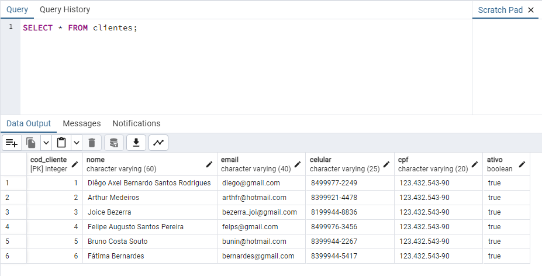

<p align="center">
  
</p>

<p align="center">
Um CRUD para CLIENTES. 
</p>

<p align="center">
  <a href="#-projeto">Projeto</a>&nbsp;&nbsp;&nbsp;|&nbsp;&nbsp;&nbsp;
  <a href="#-tecnologia">Tecnologias</a>&nbsp;&nbsp;&nbsp;|&nbsp;&nbsp;&nbsp;
  <a href="#-ferramenta">Ferramaneta</a>&nbsp;&nbsp;&nbsp;|&nbsp;&nbsp;&nbsp;
  <a href="#-ferramenta">Banco de Dados</a>&nbsp;&nbsp;&nbsp;|&nbsp;&nbsp;&nbsp;
  <a href="#-sobre">Sobre</a>&nbsp;&nbsp;&nbsp;|&nbsp;&nbsp;&nbsp;
  <a href="#-sobre">Passo-A-Passo</a>
  
</p>
<br>
<p align="center">
  
</p>

## 🚀 Tecnologia

Esse projeto foi desenvolvido com a seguinte tecnologia:

- Python

## 🎮 Ferramenta
Esse projeto foi desenvolvido com o seguinte editor de código:

- Visual Studio Code

## 💼 Banco de Dados
Esse projeto foi desenvolvido com o seguinte Banco de Dados:

- PostgreSQL

## Sobre

- Este é um projeto pessoal, que tem o intuito de ser um CRUD Simples apenas para usuários/clientes.

- Nele, tem tudo o que um CRUD possui, Cadastrar, Exibir Dados, Alterar Dados, Excluir Dados e por fim, um extra, mostrar todos os Clientes Cadastrados. 

- Deixando claro que, todos esses dados estão sendo salvo em um banco de dados(PostegreSQL) na minha própria máquina.

- Agora, vou lhe dar o PASSO-A-PASSO de como você pode usar esse pequeno sistema (QUE AINDA ESTÁ EM DESENVOLVIMENTO) em sua máquina.

## Passo-A-Passo

### 1- Dowload Do PostgreSQL:

- Bom, primeiro você precisa se certificar se você está com o Postgre baixado em sua máquina, obviamente sem ele, o código não irá funcionar.

- Se não tiver o Postgre, clique nesse link para que assimm você possar fazer o dowload. Sobre a versão, recomendo a 9.5.25* PRA CIMA. Se a que você baixou não deu certo, sem problemas, desinstala e instale outra versão, preste atenção também se ele não abrir, se você faz uso de Anti-Vírus, ele pode estar impedindo que seu Postgre seja aberto.

```shell
https://www.enterprisedb.com/downloads/postgres-postgresql-downloads
```

### 2- Instalção do Pacote 'psycopg2':

 - Vá no seu cmd e digite esse comando no terminal:
 ````shell
 pip install psycopg2
 ````

 - psycopg2 é um Pacote que não pode ser deixado de lado, com ele será capaz de fazermos a conexão com o nosso banco de dados logo no início do código.

 ### 3- Criando o DATABASE:

 - Bom, para começarmos a estabelcer conexão com o banco de dados, primeiro você precisa criar esse banco, isso é bem simples.

 - Vá no seu PGADMIM(PostgreSQL) clique em servers, e depois clique em postgres, literalmente a imagem dele, por fim, clique no postgres que tem uma espécie de 'moeda' ao seu lado esquerdo, isso é um DATABASE, um banco, mas vamos criar um próprio.

 - No seu PGADMIN vá em:

````shell
 Servers | PostregreSQL | PostgreSQL (DATABASE)
 ````

- Bem, após clicar no DATABASE, abra a query tools, em cima do servidor. Lá digite esse mesmo comando aqui embaixo:

````shell
CREATE DATABASE nome_banco --NOME DE SUA PREFERÊNCIA PARA SEU BANCO DE DADOS
````

 ### 4- Conectar ao banco de dados PostgreSQL:

 - Postgre baixado, pacote psycopg2 instaldo, DATABASE criado, agora vamos estabelecer conexão... 
 
 - Em seu código python, para começar uma conexão, lembre-se de tratar o erro (ver meu código) após isso, vamos conectar-se:

````shell
connection = psycopg2.connect(
  user="", # Seu usuário lá no banco de dados
  password="", # Senha que foi criada por você quando baixou o Postgres
  host="", # O host =, se for em sua máquina, então será localhost
  port="", # A porta está nas propriedades do banco
  database="" # O nome do DATABASE que você criou anteriomente
)
````

### 5- Final:

- Bom, por fim é isso, o resto, sugiro que você dê uma olhada no meu código, que la vai ter todos os comandos SQL, para -> Criar, tabela, selecionar usuário, deletar, alterar...
